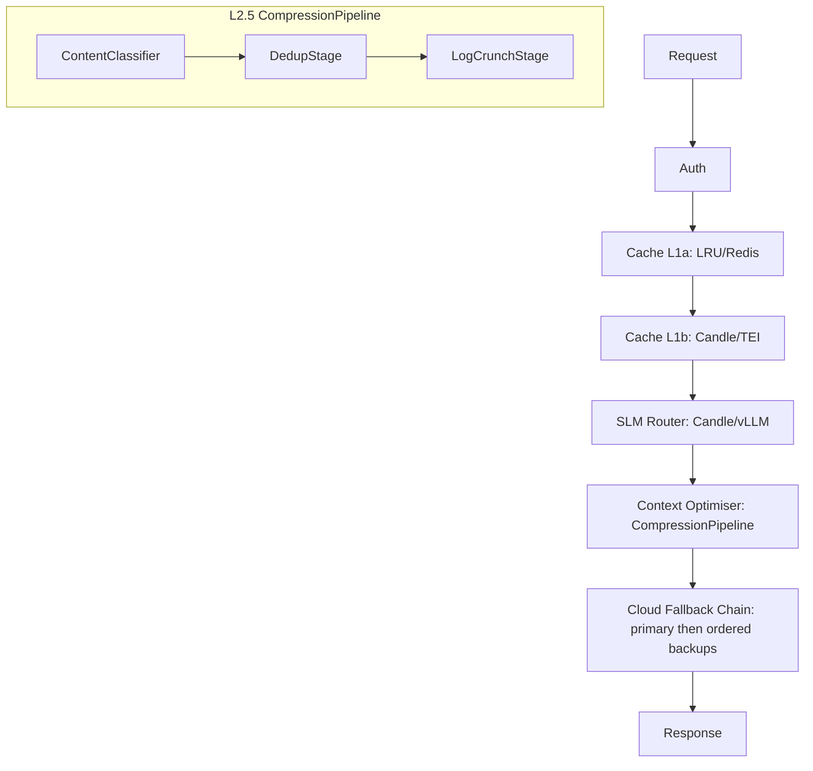

# Architecture

> **Pattern:** Hexagonal Architecture (Ports & Adapters)
> **Location:** `src/core/`, `src/adapters/`, `src/factory.rs`

## High-Level Overview

Isartor is an AI Prompt Firewall that intercepts LLM traffic and routes it through a multi-layer **Deflection Stack**. Each layer can short-circuit and return a response without reaching the cloud, dramatically reducing cost and latency.

Documentation contract: if an implementation changes this architecture, the request flow, supported surfaces, deployment shape, or other durable design assumptions, update this page and the ADR pages in the same patch. User-visible capability changes should also be reflected in the `README.md` feature list and the relevant docs under `docs/` and `docs-site/src/`.

At the HTTP boundary, request-time model aliases are normalized to real provider model IDs before Layer 1 cache keys are built or Layer 3 routing runs. That keeps aliases like `fast` and their canonical target model on the same routing and cache path.

When operators need full payload troubleshooting, the outer monitoring middleware can also emit a separate opt-in JSONL request log with redacted auth headers. This request log is intentionally kept separate from normal tracing / startup logs so OpenTelemetry metadata and sensitive body captures do not share the same sink by default.

Layer 3 now also maintains a broader provider registry for OpenAI-compatible backends. Where possible, Isartor reuses a shared OpenAI-compatible runtime path with provider-specific default endpoints instead of duplicating nearly identical client logic for every vendor.

The running `AppState` also maintains an ordered Layer 3 provider chain: one primary provider plus zero or more optional fallbacks. Each provider keeps its own retry budget, and Isartor only advances to the next provider when the current one exhausts retries with a retry-safe upstream error. Successful Layer 3 responses are annotated with `x-isartor-provider` so clients can tell which upstream actually answered.

Each provider can now also own a small in-memory key pool. When multiple credentials are configured for the same provider, Isartor selects keys with `round_robin` or `priority` rotation and temporarily cools down only the rate-limited key after `429` / quota-style failures. That keeps fallback between providers separate from rotation within a provider.

That same `AppState` now keeps a small in-memory provider-health snapshot for the whole configured Layer 3 chain. The authenticated `GET /debug/providers` endpoint and the `isartor providers` CLI command expose the active provider plus every configured backup, including endpoint, request/error counts, masked key-pool entries, and the last-known success or failure without enabling full request-body logging.

At the protocol boundary, Isartor now supports four inbound request families that share the same deflection stack but keep cache keys namespaced by response shape: native (`/api/chat`), OpenAI-compatible (`/v1/chat/completions`), Anthropic-compatible (`/v1/messages`), and Gemini-native (`/v1beta/models/{model}:generateContent` plus `:streamGenerateContent`). Streaming is still a boundary concern: handlers produce canonical JSON, while middleware converts successful cached or downstream responses into the surface-specific SSE format when the client uses a streaming route.


For a detailed breakdown of the deflection layers, see the [Deflection Stack](deflection-stack.md) page.



## Pluggable Trait Provider Pattern

All layers are implemented as Rust traits and adapters. Backends are selected at startup via `ISARTOR__` environment variables — no code changes or recompilation required.

Rather than feature-flag every call-site, we define **Ports** (trait interfaces in `src/core/ports.rs`) and swap the concrete **Adapter** at startup. This keeps the Deflection Stack logic completely agnostic to the backing implementation.

| Component | Minimalist (Single Binary) | Enterprise (K8s) |
|:----------|:---------------------------|:------------------|
| **L1a Exact Cache** | In-memory LRU (`ahash` + `parking_lot`) | Redis cluster (shared across replicas) |
| **L1b Semantic Cache** | In-process `candle` BertModel | External TEI sidecar (optional) |
| **L2 SLM Router** | Embedded `candle` GGUF inference | Remote vLLM / TGI server (GPU pool) |
| **L2.5 Context Optimiser** | In-process CompressionPipeline (classifier → dedup → log_crunch) | In-process CompressionPipeline (extensible with custom stages) |
| **L3 Cloud Logic** | Direct to OpenAI / Anthropic | Direct to OpenAI / Anthropic |

### Adding a New Adapter

1. **Define the struct** in `src/adapters/cache.rs` or `src/adapters/router.rs`.
2. **Implement the port trait** (`ExactCache` or `SlmRouter`).
3. **Add a variant** to the config enum (`CacheBackend` or `RouterBackend`) in `src/config.rs`.
4. **Wire it** in `src/factory.rs` with a new `match` arm.
5. **Write tests** — each adapter module has a `#[cfg(test)] mod tests`.

No other files need to change. The middleware and pipeline code operate only on `Arc<dyn ExactCache>` / `Arc<dyn SlmRouter>`.

## Scalability Model (3-Tier)

Isartor targets a wide range of deployments, from a developer's laptop to enterprise Kubernetes clusters. The same binary serves all three tiers; the runtime behaviour is entirely configuration-driven.

```text
Level 1 (Edge)           Level 2 (Compose)        Level 3 (K8s)
┌────────────────┐       ┌────────────────┐       ┌────────────────┐
│ Single Process  │       │ Firewall + GPU  │       │ N Firewall Pods │
│ memory cache    │──▶    │ Sidecar         │──▶    │ + Redis Cluster │
│ embedded candle │       │ memory cache    │       │ + vLLM Pool     │
│ context opt.    │       │ (optional)      │       │ (optional)      │
└────────────────┘       └────────────────┘       └────────────────┘
```

**Key insight:** Switching to `cache_backend=redis` unlocks true multi-replica scaling. Without it, each firewall pod maintains an independent cache.

See the deployment guides for tier-specific setup:

- [Level 1 — Minimal](../deployment/level1-minimal.md)
- [Level 2 — Sidecar](../deployment/level2-sidecar.md)
- [Level 3 — Enterprise](../deployment/level3-enterprise.md)

## Directory Layout

```text
src/
├── core/
│   ├── mod.rs            # Re-exports
│   ├── ports.rs          # Trait interfaces (ExactCache, SlmRouter)
│   └── context_compress.rs # Re-export shim (backward compat)
├── adapters/
│   ├── mod.rs            # Re-exports
│   ├── cache.rs          # InMemoryCache, RedisExactCache
│   └── router.rs         # EmbeddedCandleRouter, RemoteVllmRouter
├── compression/
│   ├── mod.rs            # Re-exports all pipeline types
│   ├── pipeline.rs       # CompressionPipeline executor + CompressionStage trait
│   ├── cache.rs          # InstructionCache (per-session dedup state)
│   ├── optimize.rs       # Request body rewriting (JSON → pipeline → reassembly)
│   └── stages/
│       ├── content_classifier.rs  # Gate: instruction vs conversational
│       ├── dedup.rs               # Cross-turn instruction dedup
│       └── log_crunch.rs          # Static minification
├── middleware/
│   └── context_optimizer.rs  # L2.5 Axum middleware
├── factory.rs            # build_exact_cache(), build_slm_router()
└── config.rs             # CacheBackend, RouterBackend enums + AppConfig
```

## See Also

- [Deflection Stack](deflection-stack.md) — detailed layer-by-layer breakdown
- [Architecture Decision Records](architecture-decisions.md) — rationale behind key design choices
- [Configuration Reference](../configuration/reference.md)


### Usage analytics

Isartor now records per-request provider/model usage events for both cloud calls and pre-L3 deflections. Events are persisted as JSONL under `usage_log_path`, aggregated in-memory with retention pruning, and exposed through the authenticated `GET /debug/usage` endpoint plus `isartor stats --usage`.

### Provider quotas

Per-provider quota enforcement is built on top of that same usage-event stream. Before a request is dispatched to Layer 3, Isartor projects the request's token/cost impact against the configured provider's daily, weekly, and monthly windows, then either warns, blocks with `429`, or falls through to the next provider in the ordered fallback chain. This keeps quota accounting and operator reporting aligned with one shared source of truth instead of separate usage and quota stores.
