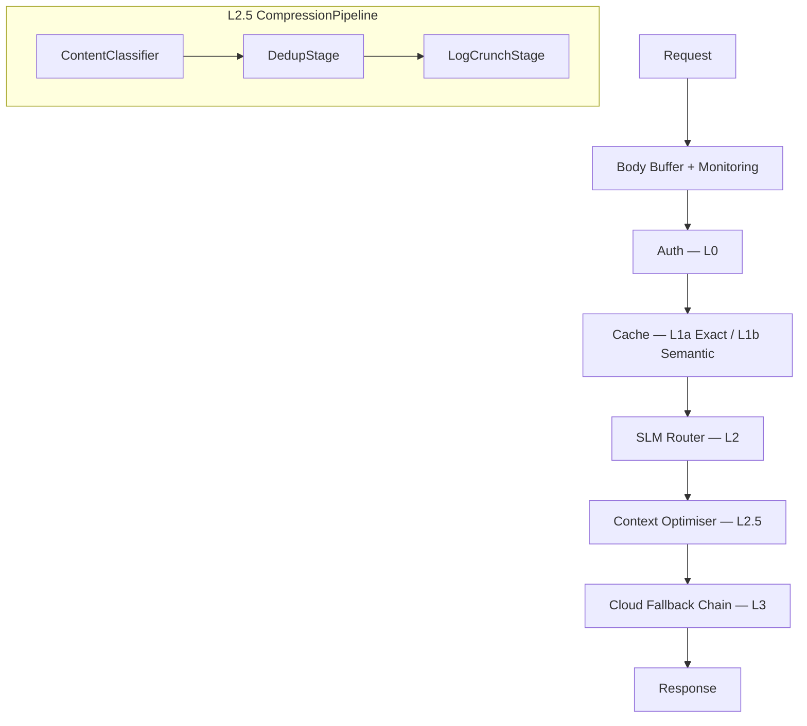

# Architecture

> **Pattern:** Hexagonal Architecture (Ports & Adapters)
> **Location:** `src/core/`, `src/adapters/`, `src/factory.rs`

## High-Level Overview

Isartor is an AI Prompt Firewall that intercepts LLM traffic and routes it through a multi-layer **Deflection Stack**. Each layer can short-circuit and return a response without reaching the cloud, dramatically reducing cost and latency.

Documentation contract: if an implementation changes this architecture, the request flow, supported surfaces, deployment shape, or other durable design assumptions, update this page and the ADR pages in the same patch. User-visible capability changes should also be reflected in the `README.md` feature list and the relevant docs under `docs/` and `docs-site/src/`.

### Request Surfaces

Isartor accepts traffic through five inbound surfaces. All share the same deflection stack but keep cache keys namespaced by response shape so one endpoint never returns another endpoint's schema:

| Surface | Route(s) | Cache Namespace |
|:--------|:---------|:----------------|
| **Native** | `POST /api/chat`, `POST /api/v1/chat` | `native` |
| **OpenAI-compatible** | `POST /v1/chat/completions` | `openai` |
| **Anthropic-compatible** | `POST /v1/messages` | `anthropic` |
| **Gemini-native** | `POST /v1beta/models/{model}:generateContent`, `:streamGenerateContent` | `gemini` |
| **CONNECT proxy** | MITM intercept on allowlisted Copilot domains (`:8081`) | `openai` (proxied) |

Streaming is a boundary concern: handlers store canonical JSON internally, while middleware converts cached or downstream responses into surface-specific SSE when the client requests streaming.

### MCP Server

Isartor also exposes a **Model Context Protocol** (MCP) server for tool integrations:

- **stdio mode:** `isartor mcp` — used by Copilot CLI, Claude Desktop, Cursor IDE
- **HTTP/SSE mode:** `GET/POST/DELETE /mcp/` — used by any MCP-compatible client

The MCP server provides cache-lookup and cache-store tools so external agents can query and populate the deflection cache directly.

### CONNECT Proxy

When started with `isartor up copilot` (or `claude`, `antigravity`), Isartor runs a transparent HTTPS CONNECT proxy on port `8081` alongside the API gateway on `:8080`. The proxy intercepts allowlisted GitHub Copilot domains, terminates TLS using a local CA (auto-generated at `~/.isartor/ca/`), and reuses the same L1/L2/L3 cache and LLM layers for `/v1/chat/completions` traffic. This lets tools like `gh copilot` benefit from Isartor's deflection stack without any client-side configuration changes beyond an HTTPS proxy setting.

### Pre-Routing Normalization

At the HTTP boundary, request-time model aliases are normalized to real provider model IDs before Layer 1 cache keys are built or Layer 3 routing runs. That keeps aliases like `fast` and their canonical target model on the same routing and cache path.

When operators need full payload troubleshooting, the outer monitoring middleware emits a separate opt-in JSONL request log with redacted auth headers. This is intentionally kept separate from normal tracing/startup logs.

For a detailed breakdown of the deflection layers, see the [Deflection Stack](deflection-stack.md) page.



## Layer 0 — Authentication & Concurrency

Layer 0 is the operational defense perimeter. It runs before any cache lookup or inference.

- **Authentication:** API key validation via the `X-API-Key` header. When `gateway_api_key` is empty (the local-first default), authentication is disabled.
- **Body buffering:** The `BufferedBody` middleware reads the request body once and stores a clone in request extensions. All downstream layers (cache key extraction, prompt parsing, monitoring, retries) read from this buffer instead of consuming the stream.
- **Monitoring:** Root request-level OpenTelemetry tracing span, optional JSONL request logging.

Public health routes (`/health`, `/healthz`) and the MCP endpoint (`/mcp/`) bypass Layer 0 and the entire deflection stack.

## Layer 1 — Cache

Layer 1 has two sub-layers that execute in sequence:

### L1a — Exact Cache

Fast-hash (`ahash`) lookup against an in-memory LRU or shared Redis cluster. Sub-millisecond on hit. Cache keys include the API surface namespace and an optional session scope (from `x-isartor-session-id` or similar headers) so different conversations and endpoints never cross-pollinate.

On a cache hit, `ChatResponse.layer` is normalized to `1` regardless of which layer originally produced the response.

### L1b — Semantic Cache

Cosine similarity over 384-dimensional sentence embeddings from an in-process `candle` BertModel (`all-MiniLM-L6-v2`). Catches semantically equivalent prompts that differ in wording (e.g. "Price?" ≈ "Cost?").

**Important:** L1b semantic cache is intentionally **disabled** for `/v1/messages` (Anthropic/Claude Code traffic) because the large, repetitive system/context payloads caused false cache hits across different user questions. Exact cache (L1a) remains active for that surface.

| Component | Minimalist | Enterprise |
|:----------|:-----------|:-----------|
| **L1a Exact Cache** | In-memory LRU (`ahash` + `parking_lot`) | Redis cluster (shared across replicas) |
| **L1b Semantic Cache** | In-process `candle` BertModel | External TEI sidecar (optional) |

## Layer 2 — SLM Router

Neural classification via a Small Language Model (e.g. Qwen-1.5B via llama.cpp sidecar). Classifies the prompt's intent and resolves simple data extraction tasks locally without reaching the cloud. Typical latency: 50–200 ms.

- **Disabled by default** (`enable_slm_router = false`): Layer is a no-op; request falls through to L2.5.
- **Classifier modes:** `tiered` (default, multi-level confidence) or `binary` (simple/complex split).

| Component | Minimalist | Enterprise |
|:----------|:-----------|:-----------|
| **L2 SLM Router** | Embedded `candle` GGUF inference (CPU) | Remote vLLM / TGI server (GPU pool) |

## Layer 2.5 — Context Optimiser

A modular `CompressionPipeline` with pluggable stages that reduce cloud input tokens by compressing repeated instruction payloads (CLAUDE.md, copilot-instructions.md, skills blocks).

**Built-in stages (execute in order):**

1. **ContentClassifier** — Gate: detects instruction vs conversational content. Short-circuits on conversational messages.
2. **DedupStage** — Session-aware cross-turn instruction deduplication. Hashes instruction content; on repeat turns, replaces with compact hash reference.
3. **LogCrunchStage** — Static minification: strips comments, decorative rules, consecutive blank lines.

Each stage is a stateless `CompressionStage` trait object. Shared state (the `InstructionCache`) is passed as input. If a stage sets `short_circuit = true`, subsequent stages are skipped.

| Component | Minimalist | Enterprise |
|:----------|:-----------|:-----------|
| **L2.5 Context Optimiser** | In-process CompressionPipeline | In-process CompressionPipeline (extensible with custom stages) |

## Layer 3 — Cloud Logic

Only the hardest prompts — those not resolved by cache, SLM, or context optimisation — reach Layer 3.

### Provider Chain

The running `AppState` maintains an **ordered provider chain**: one primary provider plus zero or more fallback providers. Each provider keeps its own retry budget (exponential backoff with jitter). Isartor advances to the next provider only when the current one exhausts retries with a retry-safe upstream error (429, 5xx, timeout). Successful responses are annotated with `x-isartor-provider` so clients can see which upstream answered.

### Provider Registry

Layer 3 supports 23+ LLM providers through `rig-core`:

**Full client:** OpenAI, Azure OpenAI, Anthropic, Copilot (GitHub), Gemini, Cohere, xAI

**OpenAI-compatible registry** (shared runtime path with provider-specific default endpoints): Groq, Cerebras, Nebius, SiliconFlow, Fireworks, NVIDIA, Chutes, DeepSeek, Galadriel, Hyperbolic, HuggingFace, Mira, Moonshot, Ollama, OpenRouter, Perplexity, Together

### Multi-Key Rotation

Each provider can own an in-memory key pool. When multiple credentials are configured, Isartor selects keys with `round_robin` or `priority` rotation and temporarily cools down only the rate-limited key after 429/quota-style failures. Key rotation is separate from provider-level fallback.

### Provider Health

A small in-memory provider-health snapshot tracks request/error counts, last success/failure, and masked key-pool entries for the entire configured chain. Exposed via `GET /debug/providers` and `isartor providers`.

### Quota Enforcement

Per-provider quota enforcement is built on top of the usage-event stream (see below). Before a request is dispatched to Layer 3, Isartor projects the request's token/cost impact against the provider's configured daily, weekly, and monthly windows, then either warns, blocks with `429`, or falls through to the next provider in the ordered fallback chain.

### Stale Fallback

On L3 failure, the handler checks the namespaced exact-cache key first, then a legacy un-namespaced key for backward compatibility.

### Offline Mode

When `offline_mode = true`, Layer 3 is blocked explicitly — returns HTTP 503 instead of silently pretending success.

## Usage Analytics

Isartor records per-request provider/model usage events for both cloud calls and pre-L3 deflections. Events are persisted as append-only JSONL under `usage_log_path`, aggregated in-memory with retention pruning, and exposed through:

- `isartor stats --usage` — CLI usage breakdown by provider/model
- `isartor stats --by-tool` — CLI usage breakdown by client tool

Deflected requests are recorded as saved cost against the configured primary provider/model, while actual cloud calls record estimated prompt/completion usage against the provider/model that served the request.

## Pluggable Trait Provider Pattern

All layers are implemented as Rust traits and adapters. Backends are selected at startup via `ISARTOR__` environment variables — no code changes or recompilation required.

Rather than feature-flag every call-site, we define **Ports** (trait interfaces in `src/core/ports.rs`) and swap the concrete **Adapter** at startup. This keeps the Deflection Stack logic completely agnostic to the backing implementation.

### Adding a New Adapter

1. **Define the struct** in `src/adapters/cache.rs` or `src/adapters/router.rs`.
2. **Implement the port trait** (`ExactCache` or `SlmRouter`).
3. **Add a variant** to the config enum (`CacheBackend` or `RouterBackend`) in `src/config.rs`.
4. **Wire it** in `src/factory.rs` with a new `match` arm.
5. **Write tests** — each adapter module has a `#[cfg(test)] mod tests`.

No other files need to change. The middleware and pipeline code operate only on `Arc<dyn ExactCache>` / `Arc<dyn SlmRouter>`.

## Scalability Model (3-Tier)

Isartor targets a wide range of deployments, from a developer's laptop to enterprise Kubernetes clusters. The same binary serves all three tiers; the runtime behaviour is entirely configuration-driven.

```text
Level 1 (Edge)           Level 2 (Compose)        Level 3 (K8s)
┌────────────────┐       ┌────────────────┐       ┌────────────────┐
│ Single Process  │       │ Firewall + GPU  │       │ N Firewall Pods │
│ memory cache    │──▶    │ Sidecar         │──▶    │ + Redis Cluster │
│ embedded candle │       │ memory cache    │       │ + vLLM Pool     │
│ context opt.    │       │ (optional)      │       │ (optional)      │
└────────────────┘       └────────────────┘       └────────────────┘
```

**Key insight:** Switching to `cache_backend=redis` unlocks true multi-replica scaling. Without it, each firewall pod maintains an independent cache.

See the deployment guides for tier-specific setup:

- [Level 1 — Minimal](../deployment/level1-minimal.md)
- [Level 2 — Sidecar](../deployment/level2-sidecar.md)
- [Level 3 — Enterprise](../deployment/level3-enterprise.md)

## Directory Layout

```text
src/
├── core/
│   ├── mod.rs               # Re-exports + is_internal_endpoint()
│   ├── ports.rs             # Trait interfaces (ExactCache, SlmRouter)
│   ├── prompt.rs            # Stable prompt extraction for cache keys
│   ├── cache_scope.rs       # Session-aware cache key namespacing
│   ├── retry.rs             # Retry logic with exponential backoff
│   ├── usage.rs             # Usage event tracking + JSONL persistence
│   ├── quota.rs             # Per-provider quota enforcement
│   ├── request_logger.rs    # Opt-in JSONL request/response logging
│   └── context_compress.rs  # Re-export shim (backward compat)
├── adapters/
│   ├── cache.rs             # InMemoryCache, RedisExactCache
│   └── router.rs            # EmbeddedCandleRouter, RemoteVllmRouter
├── compression/
│   ├── pipeline.rs          # CompressionPipeline executor + CompressionStage trait
│   ├── cache.rs             # InstructionCache (per-session dedup state)
│   ├── optimize.rs          # Request body rewriting (JSON → pipeline → reassembly)
│   └── stages/
│       ├── content_classifier.rs  # Gate: instruction vs conversational
│       ├── dedup.rs               # Cross-turn instruction dedup
│       └── log_crunch.rs          # Static minification
├── middleware/
│   ├── body_buffer.rs       # BufferedBody preservation
│   ├── monitoring.rs        # OTel tracing + request logging
│   ├── auth.rs              # API key validation
│   ├── cache.rs             # L1a exact + L1b semantic cache
│   ├── slm_triage.rs        # L2 SLM intent classification
│   └── context_optimizer.rs # L2.5 compression entry point
├── providers/               # L3 provider implementations
│   └── copilot.rs           # GitHub Copilot token exchange
├── proxy/
│   ├── connect.rs           # HTTPS CONNECT interception
│   └── tls.rs               # Local CA generation + TLS termination
├── handler.rs               # All API surface handlers + provider chain execution
├── state.rs                 # AppState: shared runtime wiring hub
├── factory.rs               # build_exact_cache(), build_slm_router()
├── config.rs                # AppConfig + all configuration types
├── errors.rs                # GatewayError formatting and error chains
├── mcp.rs                   # MCP server (stdio + HTTP/SSE)
├── anthropic_sse.rs         # Anthropic SSE streaming helpers
├── gemini_sse.rs            # Gemini SSE streaming helpers
└── openai_sse.rs            # OpenAI SSE streaming helpers
```

## See Also

- [Deflection Stack](deflection-stack.md) — detailed layer-by-layer breakdown
- [Architecture Decision Records](architecture-decisions.md) — rationale behind key design choices
- [Configuration Reference](../configuration/reference.md)
